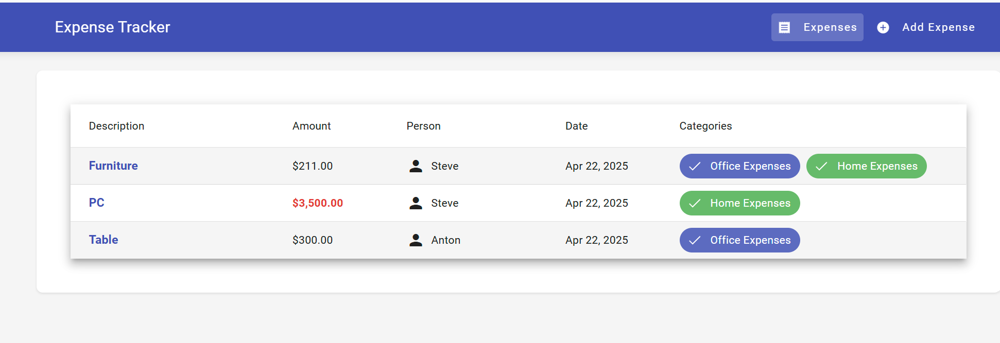

# ExpenseManager
# 💸 Expense Manager

A simple full-stack Expense Management application built using **ASP.NET Core Web API** and **Angular**. The app allows users to view and add expenses associated with predefined people and assign one or more categories to each expense.

---

## Features

- View a list of expenses
- Add a new expense
  - Description, Amount
  - Link to a Person (dropdown)
  - Assign multiple Categories (multi-select)
- Basic form validation on frontend and backend
- Data seeded for quick startup

### Seeded data for DB quick set up

Frontend UI:
### Backend API

### Frontend - Expense List

### Frontend - Add Expense Form

---

## Tech Stack

- **Backend**: ASP.NET Core Web API (.NET 8)
- **Frontend**: Angular 19.2.0
- **Database**: SQL Server Express
- **ORM**: Entity Framework Core

---

## ⚙️ Setup Instructions

### 📦 Prerequisites

- Visual Studio 2022 or newer
- SQL Server Express (LocalDB also works), you should have sql express server instance named as localhost/sqlexpress, because connect string has been configured as "Server=localhost\\SQLEXPRESS;Database=ExpenseDb;Trusted_Connection=True;TrustServerCertificate=True;"
- Node.js V22.14.0 (installed automatically with VS workload)
- Npm 10.0.0
- .NET 8 SDK

### 🧪 How to Run
1. Set the server project as the startup project, Run the server using **https** as follow, don't not use IIS express because I have configured to use https port for Api calls in Angular. This will also call npm to install all packages in Angular client project. You don't need to do anything. :)
2. Opent browser go to https://localhost:60888/, then UI will show as above as an expense list.
### Start the server

   
